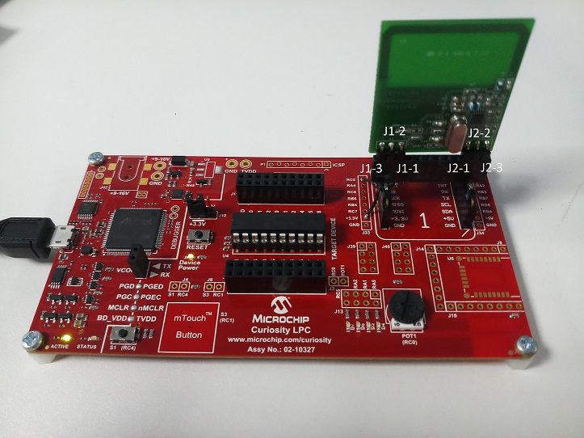
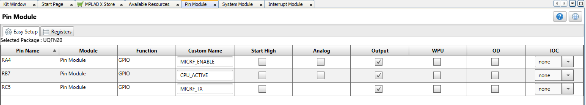
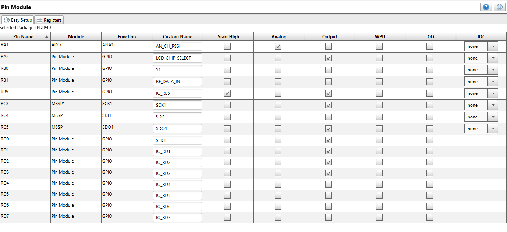

# MICRF TX CLICK WITH PIC16F1619 AND MICRF RX CLICK WITH PIC18F47K40

> "IoT Made Easy!" 

Devices: **| PIC16F1619 | PIC18F47K40 | MICRF112 | MICRF220 | MICRF219A|** 
Features: **|Sub-GHz|**

## ⚠ Disclaimer

<b>
THE SOFTWARE ARE PROVIDED "AS IS" AND GIVE A PATH FOR SELF-SUPPORT AND SELF-MAINTENANCE. This repository contains example code intended to help accelerate client product development.  

For additional Microchip repos, see: <a href="https://github.com/Microchip-MPLAB-Harmony" target="_blank">https://github.com/Microchip-MPLAB-Harmony</a>

Checkout the <a href="https://microchipsupport.force.com/s/" target="_blank">Technical support portal</a> to access our knowledge base, community forums or submit support ticket requests.

</b>

## Contents

1. [Introduction](#step1)
1. [Bill of materials](#step2)
1. [Hardware Setup](#step3)
1. [Software Setup](#step4)
1. [Harmony MCC Configuration](#step5)
1. [Board Programming](#step6)
1. [Run the demo](#step7)

## 1. Introduction<a name="step1">

This Application demonstrates the working of MICRF TX CLICK with PIC16F1619 and MICRF RX CLICK with PIC18F47K40 using ASK Modulation.

## 2. Bill of materials<a name="step2">

| Hardware Required       | Description  | Quantity |
|:- |:- |:- |
| DM164137                | Curiosity Development Board.  | 1 |
| PIC16F1619              | Change MCU on DM164137 for MICRF TX CLICK.| 1 |
| [MICRF TX CLICK](https://www.mikroe.com/micrf-tx-click)         | ASK/FSK Transmitter (315Mhz).    | 1 |
| DM160228                | Explorer 8 Development Kit.       |   1 |
| PIC18F47K40             | Change MCU on DM160228 for MICRF RX CLICK.   | 1 |
| [MICRF RX CLICK](https://www.mikroe.com/micrf-rx-click)        | ASK/OOK Receiver (315Mhz).        | 1 |
| ICD3                    | In-Circuit Debugging for DM160228    | 1 |

## 3. Hardware Setup<a name="step3">

### MICRF TX CLICK with PIC16F1619(MCU) on Curiosity Development Board.

**Step 1** - Replace the default MCU of Curiosity Development Board with PIC16F1619.

**Step 2** - Connect the Jumper J12 to 3.3V/5V based on the MCU(here PIC16F1619 has Operating voltage range 2.3V to 5.5V).

**Step 3** - Connect the MICRF TX CLICK Board to the MIKROE BUS Connector as shown below.

### MICRF RX CLICK with PIC18F47K40(MCU) on Explorer 8 Development Kit.

**Step 1** - Replace the default MCU of CExplorer 8 Development Kit with PIC18F47K40.

**Step 2** - Connect the MICRF RX CLICK Board directly into J35 Jumper (MIKROE BUS Connector).

**Step 3** - Power Explorer 8 from J1, the 9V power adapter, not from USB.

**Step 4** - Verify all the Jumper connection of the Explorer 8 Development Kit as shown below.

## 4. Software Setup<a name="step4">

- [MPLAB X IDE ](https://www.microchip.com/en-us/tools-resources/develop/mplab-x-ide#tabs)

    - Version: 6.20
	- XC8 Compiler v2.46
	- MPLAB® Code Configurator v5.3.0
	- PIC12-16F1xxx_DFP v1.3.90
	- PIC18F-K_DFP v1.7.134
	 
- [MPLAB X IPE v6.00](https://microchipdeveloper.com/ipe:installation)

## 5. Harmony MCC Configuration<a name="step5">

### Getting started with MICRF TX CLICK with PIC16F1619(MCU) on Curiosity Development Board.

| Tip | New users of MPLAB Code Configurator are recommended to go through the [overview](https://onlinedocs.microchip.com/pr/GUID-1F7007B8-9A46-4D03-AEED-650357BA760D-en-US-6/index.html?GUID-AFAB9227-B10C-4FAE-9785-98474664B50A) |
| :- | :- |

- configure the MCC configuration as shown below.

 
 
  

- Connect the USB for programming the Device from MPLAB X IDE.

### Getting started with MICRF RX CLICK with PIC18F47K40(MCU) on Explorer 8 Development Kit.

- configure the MCC configuration as shown below.

- Connect the IDC 3 In-Circuit Debugger to program the device..

## 6. Board Programming<a name="step6">

## Programming hex file:

### Program the precompiled hex file using MPLAB X IPE

- The Precompiled hex file is given in the hex folder.
Follow the steps provided in the link to [program the precompiled hex file](https://microchipdeveloper.com/ipe:programming-device) using MPLABX IPE to program the pre-compiled hex image. 

### Build and program the application using MPLAB X IDE

The application folder can be found by navigating to the following path: 

- "Transmitter/MICRF_TX.X"

- "Receiver/MICRF_RX.X"

Follow the steps provided in the link to [Build and program the application](https://microchipdeveloper.com/mplabx:build).

## 7. Run the demo<a name="step7">

- After programming the board, the expected application behavior is shown in the below [video](https://github.com/MicrochipTech/Sub-GHz_MICRF112_MICRF220-219A/blob/main/docs/Working_Demo.gif).

- The MICRF TX CLICK is a transmitter which sends the incremented counter value and whenever the data is transmitted the D7 led glows.  

- The MICRF RX CLICK is a receiver which receives the data from the MICRF TX and displays the data received along with RSSI value. 

