# MICRF112-433-EV AND MICRF220/219A-433-EV

Application for MICRF112-433-EV and MICRF220/219A-433-EV using ASK MODULATION

This package has the supporting documentation to get started with demo application on MICRF112 AND MICRF220/219A.
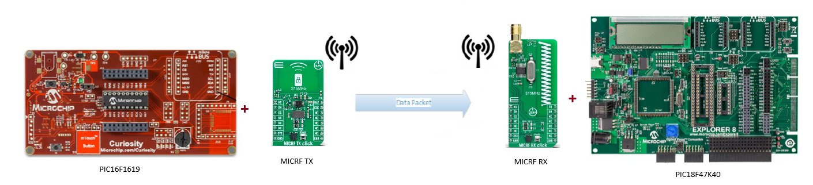

## Hardware Required

| Hardware Required       | Description                                                                                     |
|-------------------------|-------------------------------------------------------------------------------------------------|
| DM164137                | Curiosity Development Board.                                                                    |
| PIC16F1619              | Change MCU on DM164137 for MICRF112-433-EV.                                                     |
| MICRF112-433-EV         | ASK/FSK Transmitter (433Mhz).                                                                   |
| DM160228                | Explorer 8 Development Kit.                                                                     |  
| PIC18F47K40             | Change MCU on DM160228 for MICRF220/219A-433-EV.                                                |
| MICRF219A-433-EV        | ASK/OOK Receiver (433Mhz).                                                                      |
| ICD3                    | In-Circuit Debugging for DM160228                                                               |

# Getting started with MICRF112-433-EV with PIC16F1619(MCU) on Curiosity Development Board.

**Step 1** - Replace the default MCU of Curiosity Development Board with PIC16F1619.

**Step 2** - Connect the Jumper J12 to 3.3V/5V based on the MCU(here PIC16F1619 has Operating voltage range 2.3V to 5.5V).

**Step 3** - The MICRF112 Dev Board Connects to the Curiosity Board by straddling the Mikro Bus GND pins.

## Solder Jumper Wires

| MICRF112 | Curiosity     | Description |
|----------|---------------|-------------|
| J1-1     |    3.3V       |     VDD     |
| J1-2     | Mikro Bus GND |     GND     |
| J1-3     |  J33-8(RC2)   | PIC Data Out|
| J2-1     |  J34-8(RC5)   |   Enable    |
| J2-2     | Mikro Bus GND |     GND     |
| J2-3     |    N/C        |    N/C      |

**Step 4** - Connect the USB and Program the (MICRF112) application to the Device from MPLAB X IDE.

**Step 5** - Verify the MCC configuration as shown below.

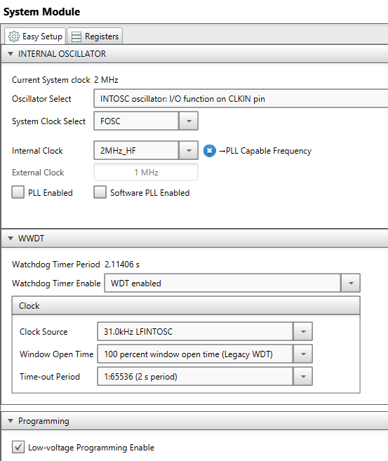
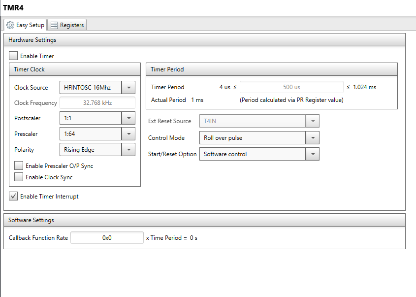

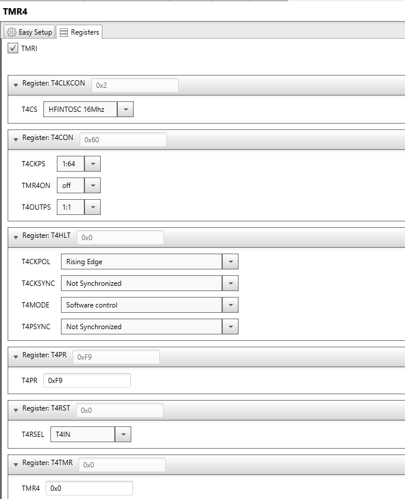
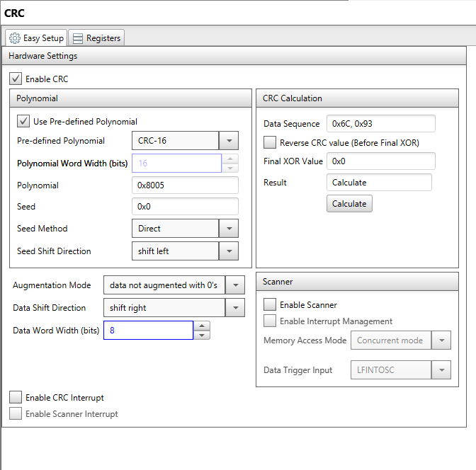

# Getting started with MICRF220/219A-433-EV with PIC18F47K40(MCU) on Explorer 8 Development Kit.

**Step 1** - Replace the default MCU of CExplorer 8 Development Kit with PIC18F47K40.

**Step 2** - Connect the MICRF220/219A-433-EV Board directly into J17(**face down**) as shown below. J3-8 of the MICRF220 connects to the Explorer 8 J17-1 and Make sure jumper 15 is tied to 3.3V.

| Note MICRF220 Pin1 does NOT connect to Pin 1 on J17! |
| --- |

**Step 3** - Power Explorer 8 from J1, the 9V power adapter, not from USB.

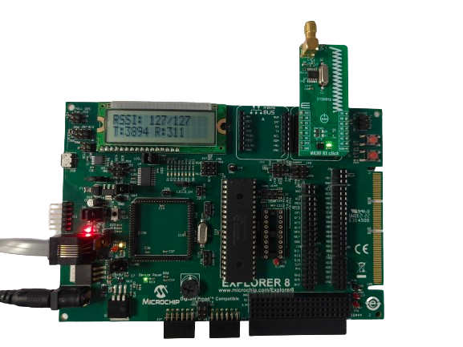

**Step 4** - Verify all the Jumper connection of the Explorer 8 Development Kit.

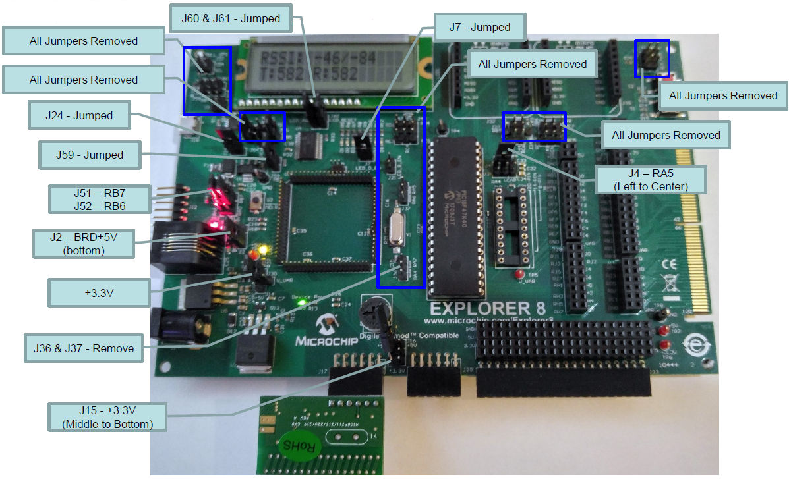

**Step 5** - Connect the IDC 3 In-Circuit Debugger to program the device..

**Step 6** - Verify the MCC configuration as shown below.

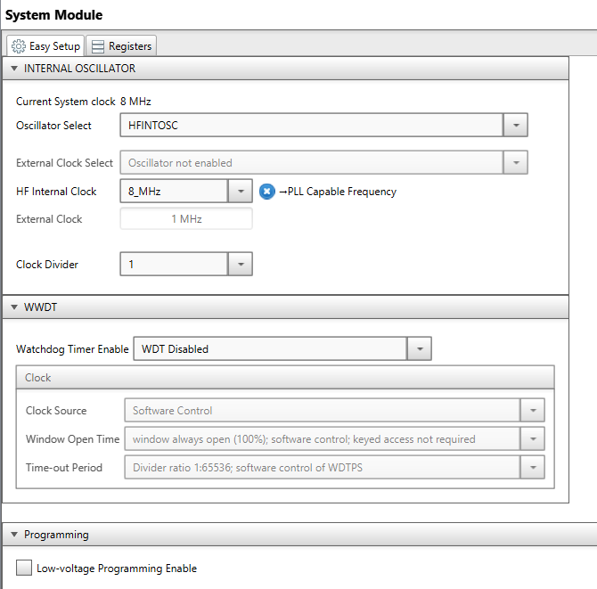
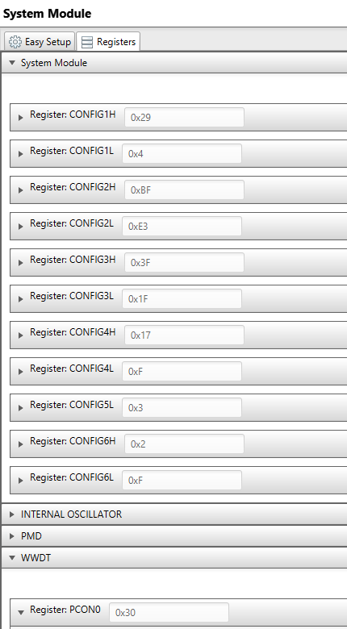

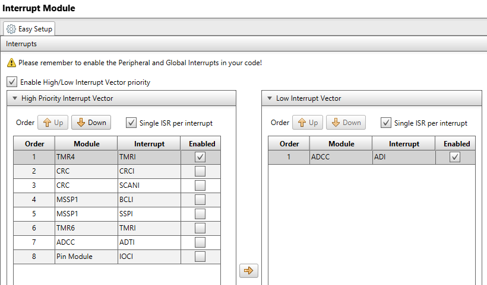
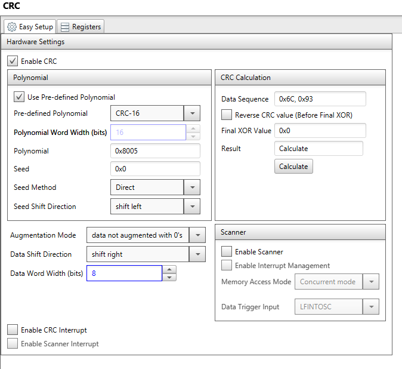

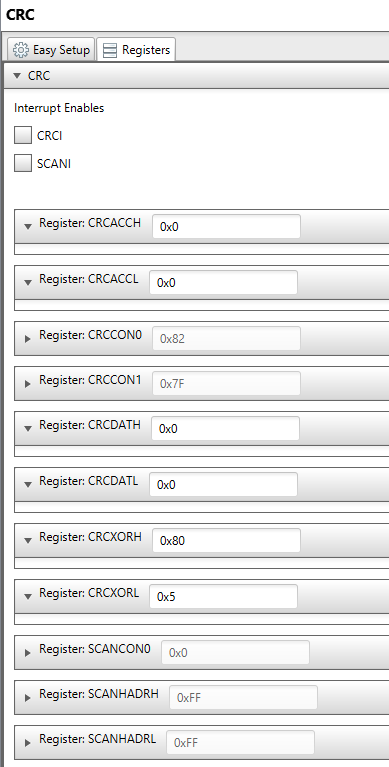
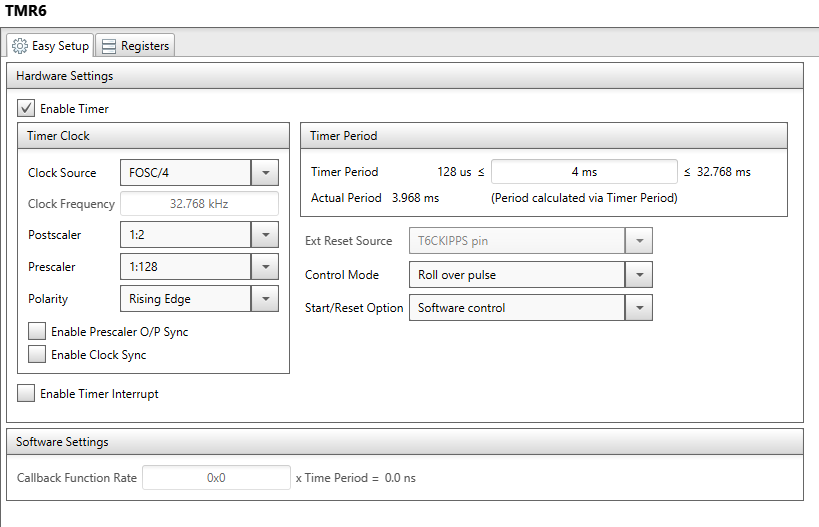

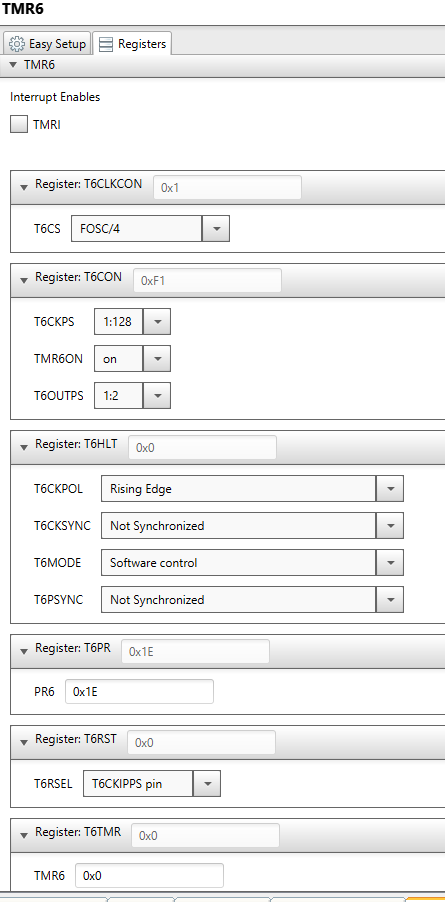
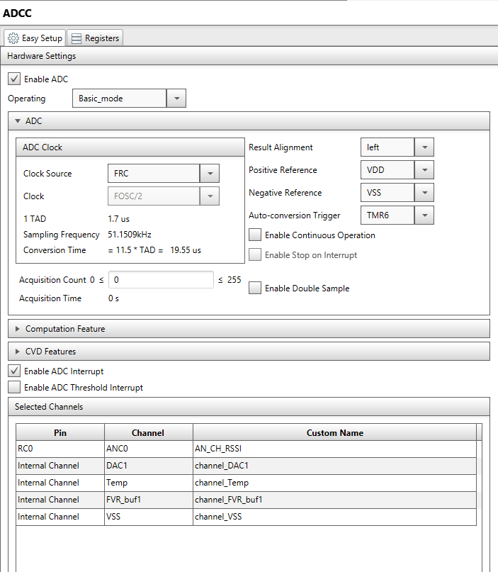

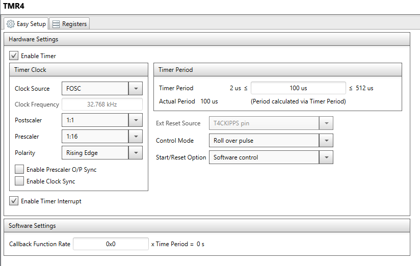
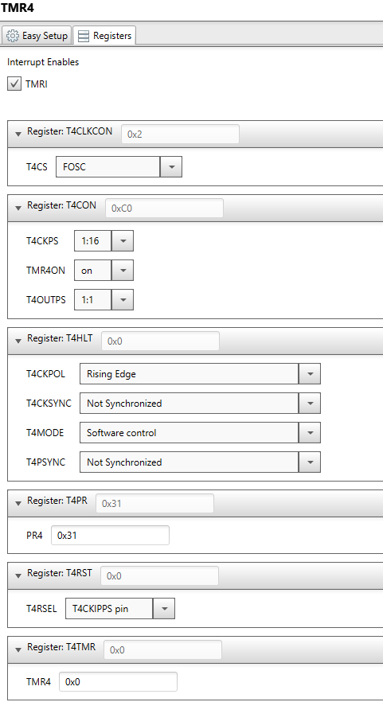
